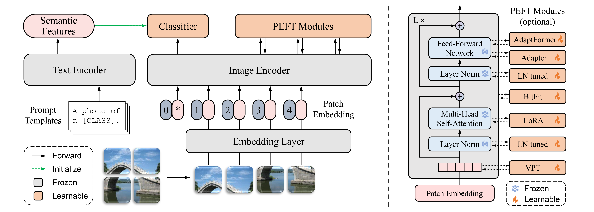

# Reproduce experiments
These reproduce experiments are based on the Parameter-Efficient Long-Tailed Recognition http://arxiv.org/abs/2309.10019

## Overview of PEL
<div align="center">
  
</div>

## Requirements

* Python 3.8
* PyTorch 2.0
* Torchvision 0.15
* Tensorboard

- Other dependencies are listed in [requirements.txt](requirements.txt).

To install requirements, run:

```sh
conda create -n pel python=3.8 -y
conda activate pel
conda install pytorch==2.0.0 torchvision==0.15.0 pytorch-cuda=11.7 -c pytorch -c nvidia
conda install tensorboard
pip install -r requirements.txt
```

We encourage installing the latest dependencies. If there are any incompatibilities, please change the dependencies with the specified version [requirements-with-version.txt](requirements-with-version.txt).

## Hardware

All experiments are conducted on the single GPU RTX3090.


## Quick Start on the CIFAR-100-LT dataset

```bash
# run PEL on CIFAR-100-LT (with imbalanced ratio=100)
python main.py -d cifar100_ir100 -m clip_vit_b16_peft 
```

By running the above command, you can automatically download the CIFAR-100 dataset and run the original PEL.

## Exploration experiments based on PEL

### LN+AdaptFormer

We keep layerNorm learnable when using Adaptformer fine-tuning pre-trained ViT.
```bash
# run LN+AdaptFormer on CIFAR-100-LT (with imbalanced ratio=100)
python main.py -d cifar100_ir100 -m clip_vit_b16_peft ln_tuning True
```

### VPT-S+Partial
Use vpt-shallow to improve partial AdaptFormer
```bash
# run VPT-S+Partial on CIFAR-100-LT (with imbalanced ratio=100)
python main.py -d cifar100_ir100 -m clip_vit_b16_peft vpt_shallow True partial 6
# run only partial
python main.py -d cifar100_ir100 -m clip_vit_b16_peft partial 6

```


## Other Dataset

Download the dataset [Places](http://places2.csail.mit.edu/download.html), [ImageNet](http://image-net.org/index), and [iNaturalist 2018](https://github.com/visipedia/inat_comp/tree/master/2018).

Put files in the following locations and change the path in the data configure files in [configs/data](configs/data):

- Places

```
Path/To/Dataset
├─ train
│  ├─ airfield
|  |  ├─ 00000001.jpg
|  |  └─ ......
│  └─ ......
└─ val
   ├─ airfield
   |  ├─ Places365_val_00000435.jpg
   |  └─ ......
   └─ ......
```

- ImageNet

```
Path/To/Dataset
├─ train
│  ├─ n01440764
|  |  ├─ n01440764_18.JPEG
|  |  └─ ......
│  └─ ......
└─ val
   ├─ n01440764
   |  ├─ ILSVRC2012_val_00000293.JPEG
   |  └─ ......
   └─ ......
```

- iNaturalist 2018

```
Path/To/Dataset
└─ train_val2018
   ├─ Actinopterygii
   |  ├─ 2229
   |  |  ├─ 2c5596da5091695e44b5604c2a53c477.jpg
   |  |  └─ ......
   |  └─ ......
   └─ ......
```


